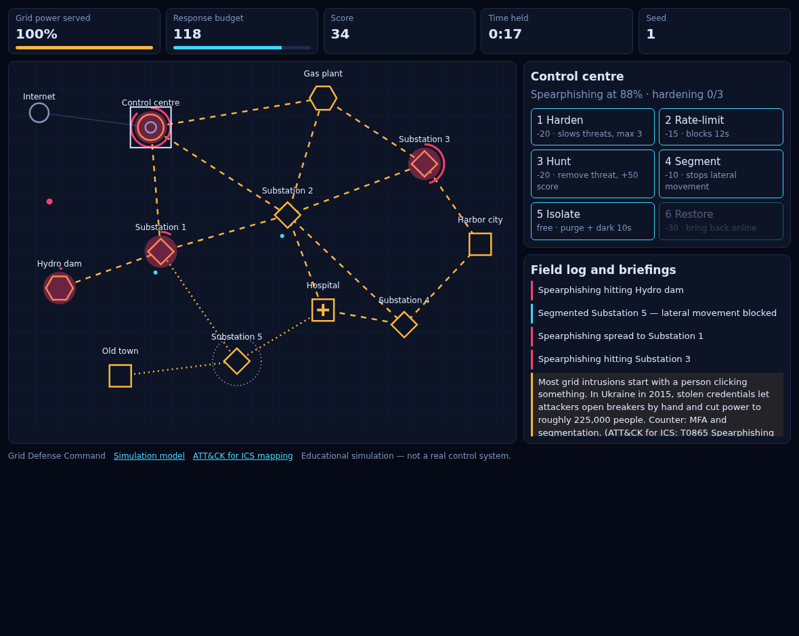

# ⚡ Grid Defense Command

[](https://github.com/ringed-in-craft/grid-defense-command/actions/workflows/ci.yml)
[](LICENSE)
[](#run-it)

> A browser simulation of how power-grid intrusions actually work — and which defences actually hold.

Attackers are coming for a regional grid. You have six defensive actions and a
budget that regenerates faster than it drains, right up until it doesn't. The
hospital is worth three times a city. The control centre is your only source of
situational awareness, and it runs on the grid you are defending.



---

## Why this exists

Most security games model "hack the thing, bar goes down". Real grid intrusions
don't work like that. Ukraine 2015 turned on stolen credentials and opened
breakers by hand. Industroyer shipped protocol implementations so it could talk
to relays directly. Colonial Pipeline was shut down by ransomware that never
touched OT.

Grid Defence Command models those mechanics rather than reskinning a tower-defence
loop. Every threat in the catalogue carries the **MITRE ATT&CK for ICS** technique
IDs it exercises, and the electrical model is real enough that standard n-1
intuition genuinely fails on it.

---

## Run it

```bash
git clone https://github.com/ringed-in-craft/grid-defense-command.git
cd grid-defense-command
npm start          # -> http://localhost:8000
```

No dependencies. The dev server is 60 lines of `node:http`.

Prefer a single file? `npm run bundle` produces `dist/grid-defense-command.html` —
~42 kB, self-contained, opens straight from the filesystem, no server and no build
step needed to run it.

**Controls:** click a node, then `1`–`6` (or the buttons). `Space` pauses,
`Esc` deselects.

**Seeded runs:** every run is deterministic. `index.html#seed=1234` reproduces a
run exactly, and the loss screen hands you the link. That is how you share a run,
and it is also what makes the engine testable.

---

## What is actually simulated

**Power flow.** Generators energise their neighbours; substations relay; loads are
sinks that do not pass power onward. The external network never carries power. The
control centre *draws* power but is not a conduit — routing supply through a control
room to reach a city would not be physical. It goes blind if it loses its feed, and
while blind every threat runs **50% faster** and **you stop seeing where threats are**.
That is ATT&CK for ICS `T0832 Manipulation of View`, and it is the nastiest thing in
the game.

**Threats.** Four techniques, each with a dwell rate, whether it moves laterally, and
which node types it seeds on. Spearphishing and ransomware spread; DDoS only ever hits
the control centre; ICS protocol attacks only target generation and substations.

**Defence.** Six actions, each with a real cost and a real trade-off:

| # | Action | Cost | Effect |
|---|--------|------|--------|
| 1 | Harden | 20 | cuts dwell rate 25% per level, max 3 |
| 2 | Rate-limit | 15 | freezes dwell entirely for 12s |
| 3 | Hunt | 20 | removes a live threat, +50 score |
| 4 | Segment | 10 | blocks lateral movement, node stays powered |
| 5 | Isolate | **free** | purges the threat, node dark 10s |
| 6 | Restore | 30 | bring a dark node back |

Isolate being free is the trap. It purges any threat instantly — and takes
everything downstream off the grid with it.

---

## Measured difficulty

Regenerate these yourself with `npm run balance` (means over 40 seeds, 400s window):

| Policy | Mean survival | Mean score |
|--------|--------------:|-----------:|
| Do nothing | 31.1s | 54 |
| **Hunt + restore** | **124.1s** | **1708** |
| Isolate every threat (free) | 73.0s | 115 |
| Segment then hunt | 111.5s | 1284 |

Two things fall out of that table, and both are deliberate:

- **Isolate-spam is dominated.** The free action loses to the expensive one, because
  isolating a hub blacks out the load behind it. There is no cheap dominant strategy.
- **No policy survives indefinitely.** The spawn ramp keeps tightening, so a run always
  ends. The score is *how long you held the lights on*, not whether you "won".

Power-flow facts the tests pin down:

| State | Load served |
|-------|------------:|
| All online | 1.000 |
| Substation 2 lost | 1.000 |
| Substation 2 + hydro dam lost | 0.286 (= 2/7) |
| Substation 2 + hydro dam + Substation 3 lost | 0.000 |

Losing Substation 2 alone changes nothing — the mesh reroutes. That is real redundancy,
and it is why the game does not reward simply defending the biggest-looking node.

---

## MITRE ATT&CK for ICS mapping

| Threat | Techniques | Source incident modelled |
|--------|-----------|--------------------------|
| Spearphishing | `T0865`, `T0859` | Ukraine 2015 — stolen credentials, breakers opened by hand, ~225,000 people dark |
| Denial of service | `T0814`, `T0832` | Operators blinded; every threat accelerates 50% while the control centre is down |
| ICS protocol attack | `T0836`, `T0855` | Industroyer — IEC 60870-5-104 and Modbus spoken directly to relays |
| Ransomware | `T1486`, `T0826` | Colonial Pipeline 2021 — shut down over IT-side ransomware, OT never touched |

Full write-up in [`docs/TTP-MAPPING.md`](docs/TTP-MAPPING.md).
Simulation model in [`docs/MODEL.md`](docs/MODEL.md).

---

## Architecture

Two layers, cut along the seam that lets more scenarios exist.

```
src/engine/          scenario-agnostic machinery. Knows graphs, dwell, cost and
                     objectives — and nothing about power grids.
  rng.js             seeded PRNG; every random decision routes through it
  events.js          the event contract — how the engine talks to any UI
  graph.js           assets, links, adjacency, declared per-node state
  resources.js       the budget pool
  objective.js       score accrual + loss predicate
  threats.js         seeding, dwell escalation, lateral movement
  actions.js         guard -> charge -> apply, plus the canApply invariant
  run.js             createRun / step / applyAction — the orchestrator

src/scenario/grid/   the grid game: data plus two solver functions
  topology.js        the Harbor region mesh (data)
  threats.js         threat catalogue + ATT&CK for ICS mapping (data)
  actions.js         the six defensive actions
  flow.js            powerFlow (the `flow` solver) and isBlind (the `senses` solver)
  index.js           assembles the pack, plus the tuning constants

src/sim.js           the public facade; API unchanged across the split
src/render.js        canvas drawing — reads state, owns none
src/ui.js            DOM binding; builds action buttons from ACTIONS
src/main.js          loop, input, wiring, seeded URLs

test/                scenario invariants (power, threats, actions, difficulty)
test/engine/         engine invariants, driven by a non-grid fixture
test/browser-smoke.html   end-to-end: real clicks, real buttons, real loop
scripts/             serve.mjs · bundle.mjs · smoke.mjs · balance.mjs
```

A scenario is a **pack**: topology, threat catalogue, action set, two solver
functions (`flow` → service ratio, `senses` → operator blindness) and the numbers.
The engine reads nothing else, and it holds no DOM, canvas or timing reference.

`test/engine/` is what proves the split is real rather than cosmetic. It runs the
engine against an **orchard** fixture — fruit trees, a blight, "trimming" instead of
hardening — where no node type, threat or action shares a name with the grid scenario.
If a blight spreading across trees runs on the same machinery as spearphishing across
a substation mesh, the engine genuinely knows nothing about either domain.

---

## Tests

```bash
npm test                 # 105 unit tests, node:test, no dependencies
                         #   38 scenario (grid) + 67 engine
npm start                # then open /test/browser-smoke.html for the 27-check
                         # end-to-end run (real canvas clicks, real loop)
```

The scenario tests encode the invariants that matter: that the power model is
electrically coherent, that lateral movement only ever crosses an edge, that a
segmented node really does block infection, that `canApply` (which drives button
state) can never disagree with `applyAction` (which mutates state), and that the same
seed reproduces a run exactly.

The engine tests run the same assertions against a fixture that shares nothing with
this game but the machinery — see the Architecture section.

The browser smoke test loads the real `index.html` in an iframe and drives it —
dispatching actual `MouseEvent`s at the canvas and clicking actual buttons. It found two
genuine bugs during development that unit tests could not: the game running behind the
intro overlay, and the game-over overlay failing to reappear on the second loss.

---

## Authoring a scenario

Scenarios are plain data — no engine changes needed. Drop a new object into
`src/scenarios.js`:

```js
export const MY_GRID = {
  id: 'my-grid',
  name: 'My region',
  nodes: [
    { id: 'P1', name: 'Hydro dam', type: 'gen', x: 0.1, y: 0.5 },
    { id: 'H',  name: 'Hospital',  type: 'load', x: 0.6, y: 0.5, weight: 3 }
  ],
  links: [['P1', 'H']]
};
```

Then load it with `index.html#scenario=my-grid`. Write a couple of tests against it
and the difficulty report will pick it up once you point it at the new scenario.

---

## Legal

An **educational simulation**. It models publicly documented attack techniques against a
fictional grid topology. There is no real ICS protocol implementation here, nothing talks
to real hardware, and nothing in this repository is a tool for attacking a real control
system. The incident references are drawn from public post-incident reporting
(Electricity Information Sharing and Analysis Centre, MITRE ATT&CK for ICS, and public
regulator reports).

---

## Credits

Built with the browser, and nothing else. No framework, no bundler, no runtime
dependencies — the entire shipped payload is HTML, CSS and ES modules.
